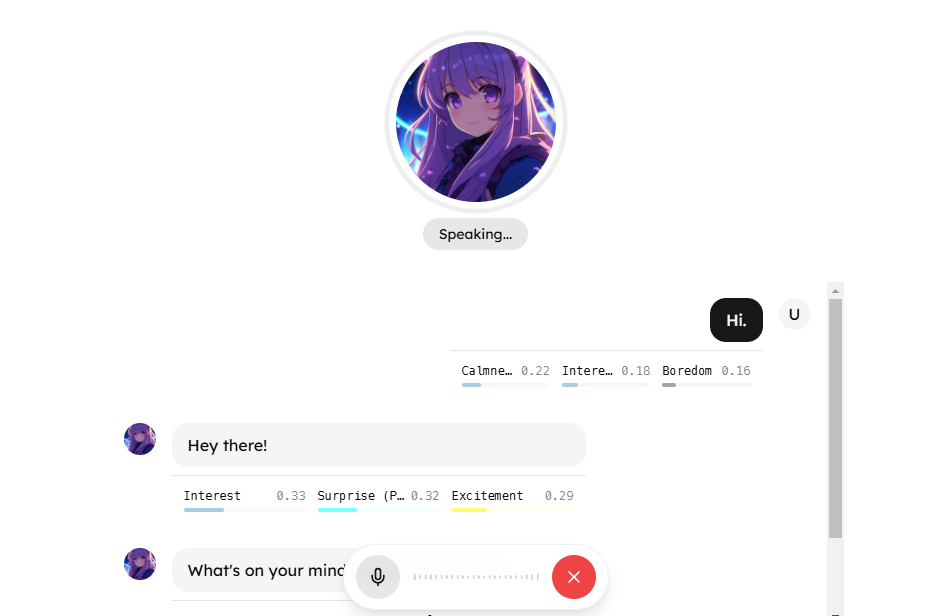

<a href="https://emotisync.xyz">
  
  <h1 align="center">Meet EmotiSync — Your personalized AI voice companion for emotional health</h1>
</a>

<p align="center">
Skip writing, just talk naturally. Your AI companion transforms your daily voice conversations into personalized insights and recommendations, helping you find clarity and growth in minutes.
</p>

 <p align="center">
   <a href="#features"><strong>Features</strong></a> ·
  <a href="#tech-stack"><strong>Tech Stack</strong></a> ·
  <a href="#setup"><strong>Setup</strong></a> ·
  <a href="#roadmap"><strong>Roadmap</strong></a>
</p>
<br/>

## Features

- **Empathetic voice AI:** Express yourself through natural voice conversations with AI who listens and responds with empathy.
- **Mood-boosting recommendations:** Receive personalized actionable recommendations that actually work for you.
- **Smart journal summaries:** Automatically generate journal summaries that track your reflection progress - zero writing required.
- **Tailored insights:** Get personalized insights tailored to your unique mood.
- **Real-time guidance:** Get instant feedback and real-time reflections tailored to your mood.
- **Customize your AI avatar:** Customize your AI avatar to your unique personality.

## Tech Stack

- **Frontend:** [Next.js 14](https://nextjs.org), [Tailwind CSS](https://tailwindcss.com), [Shadcn UI](https://ui.shadcn.com/), [Framer Motion](https://www.framer.com/motion/)
- **Backend:** [PostgreSQL](https://www.postgresql.org/), [Supabase](https://supabase.com/), [Drizzle ORM](https://orm.drizzle.team/), [Server Actions](https://nextjs.org/docs/app/building-your-application/data-fetching/server-actions-and-mutations)
- **Authentication:** [Supabase Auth](https://supabase.com/), [Capx Auth](https://capx.ai/)
- **Payments:** [Stripe](https://stripe.com/)
- **Voice AI Agents:** [Hume AI](https://hume.ai/)
- **LLM API:** [Claude 3.5 Sonnet](https://anthropic.com/)
- **Language:** [TypeScript](https://www.typescriptlang.org/)
- **Form Management:** [React Hook Form](https://react-hook-form.com/)
- **State Management:** [Zustand](https://zustand-demo.pmnd.rs/)
- **Validation:** [Zod](https://zod.dev/)
- **Rate limiting:** [Upstash](https://upstash.com/)
- **Formatter & Linter:** [Biome](https://biomejs.dev/)
- **Package Manager:** [Bun](https://bun.sh/)

## Setup

1. Clone the repository

   ```bash
   git clone https://github.com/samueldanso/emotisync.git
   ```

2. Install dependencies

   ```bash
   bun install
   ```

3. Copy the `.env.example` to `.env` and update the variables.

   ```bash
   cp .env.example .env
   ```

4. Migrate the database schema

   ```bash
   bun db:push
   ```

5. Start the development server

   ```bash
   bun dev
   ```

## Deploy

Follow the deployment guides for [Vercel](https://nextjs.org/learn-pages-router/basics/deploying-nextjs-app/deploy).

## Roadmap

- [ ] Implement social sharing and group chats feature
- [ ] Implement mood insights feature
- [ ] Implement rewards and invites feature
- [ ] Implement AI avatar customization feature

## Contributing

Contributions are welcome! Please feel free to open an issue or submit a pull request.
